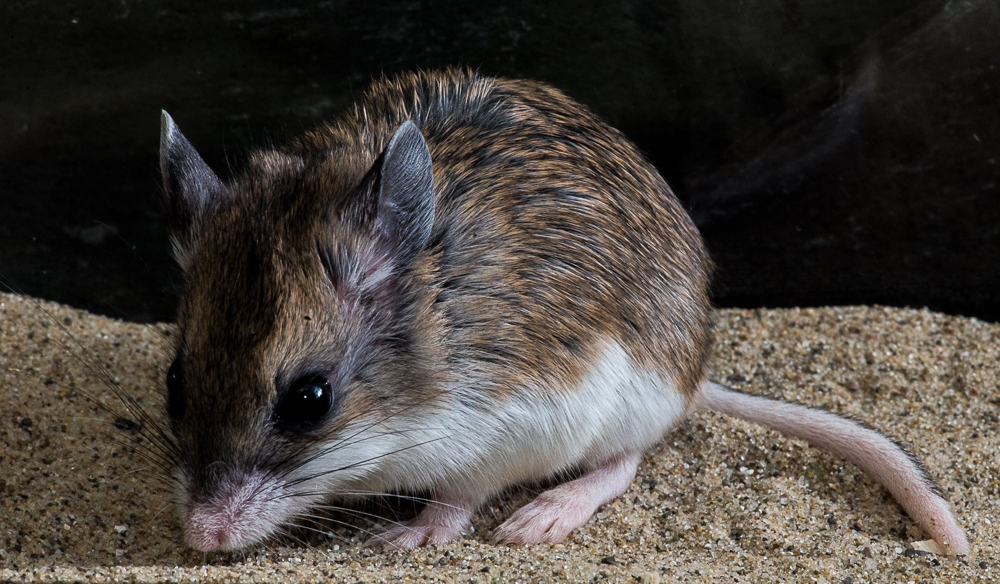

## Using a novel model system to understand the interactions between voltage-gated sodium ion channels and gating-modifier neurotoxins

This research was conducted in Dr. Ashlee Rowe's lab (now at the University of Oklahoma).

Southern grasshopper mouse and Arizona bark scorpion. Photo credit: Dr. Matt Rowe

Grasshopper mice (*Onychomys torridus*) are predatory desert rodents that regularly hunt bark scorpions (*Centruroides sculpturatus*). Unlike other small mammals (e.g., infant humans), grasshopper mice do not experience the pain and muscle paralysis that usually follow scorpion envenomation. This physiological resistance to scorpion venom makes grasshopper mice a great model to study pain and paralysis.

#### Scorpion venom targets ion channels
Bark scorpions cause pain and death by disrupting the function (or gating) of voltage-gated sodium and potassium ion channels. Previous work in the Rowe lab has shown that voltage-gated sodium channels expressed in the pain pathway of grasshopper mice carry key amino acid modifications that enable the ion channels to bind with the venom and shut down pain signals; i.e., the grasshopper mouse uses venom as an analgesic!

Although we now understand some aspects of pain resistance, we know little about the mechanisms involved in resistance to venom-induced mortality. Bark scorpion toxins are known to kill by disrupting the function of voltage-gated ion channels in the diaphragm muscles. The toxins bind to muscle ion channels and induce premature and prolonged opening of these channels. Paralysis of the diaphragm muscle ultimately causes death by asphyxiation.

#### Grasshopper mouse muscle sodium ion channels are less sensitive to scorpion venom!
We used molecular biology, electrophysiology, and molecular evolutionary algorithms to understand the structural and functional properties of sodium ion channels expressed in the muscles of grasshopper mice. Our research showed that grasshopper mouse muscle sodium ion channels carry unique amino acid modifications that make them less sensitive to the effects of gating modifier (scorpion) neurotoxins. To take this one step further, we created recombinant genetic constructs of sodium channels and identified the functional consequences of amino acid substitutions in these important proteins. 

## The behavioral repertoire of *Drosophila melanogaster* in the presence of two predator species that differ in hunting mode

Research in Dr. Ian Dworkin's lab (now at McMaster University).

The fruit fly *Drosophila melanogaster* is widely used in genetics, genomics, and neuroscience research. But despite this, we know little about its natural behavior in the wild. For one of my PhD projects, we looked at how two different types of predators affect fruit fly behavior: zebra jumping spiders (*Salticus scenicus*), which actively hunt, and Chinese praying mantids (*Tenodera sinensis*), which wait and ambush their prey. We observed that fruit flies showed three notable behaviors more often when predators were around: lifting their abdomen, stopping, and retreating. While the mantids had a small effect on how much the flies moved, the jumping spiders caused a clear increase in the flies’ overall activity. We also found that individual flies varied a lot in how they responded to both predators.

## Masters Research Project at The University of Leicester 

As a part of my master's project, I have worked on the development of LINE1 retrotransposon based molecular makers to be used in the selective breeding of captive chimpanzees. The project was supervised by Dr. Richard Badge.